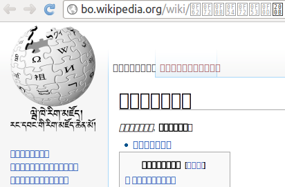

# Arch Linux Font Improvement Guide


This guide focuses on the smallest useful font-rendering changes for current Arch Linux. Modern Arch already ships sensible Fontconfig rendering defaults, so the goal is to avoid duplicating them and only add behavior that is still useful.

> [!NOTE]
> Reviewed against current Arch Linux and Fontconfig behavior in September 2026.

## What Arch already does well

Current Arch Linux already enables the important baseline rendering settings through its `fontconfig` package:

- anti-aliasing
- hinting
- `hintslight`
- `lcddefault`

The package ships these active defaults in `/usr/share/fontconfig/conf.default/`, including `10-yes-antialias.conf`, `10-hinting-slight.conf`, and `11-lcdfilter-default.conf`.

Because those settings are already provided, this guide no longer recommends creating a custom XML file that repeats them, re-linking those presets manually, or forcing FreeType settings that are already the default.

The one additional rendering policy that is broadly useful is to prefer scalable fonts while still allowing bitmap emoji.

## 1. Make sure Fontconfig is available

Most graphical Arch installations already have `fontconfig` through desktop and application dependencies. Check before installing anything:

```sh
pacman -Q fontconfig
```

If it is not installed, add it:

```sh
sudo pacman -S fontconfig
```

No additional font family is required for the rendering improvement in this guide.

## 2. Enable the scalable-font preference

Fontconfig ships a preset specifically for rejecting ordinary bitmap-font fallbacks while preserving bitmap emoji:

```text
/usr/share/fontconfig/conf.avail/70-no-bitmaps-except-emoji.conf
```

Enable it globally by linking it into `/etc/fonts/conf.d/`.

For a normal system where the destination does not already exist:

```sh
sudo ln -s /usr/share/fontconfig/conf.avail/70-no-bitmaps-except-emoji.conf \
  /etc/fonts/conf.d/70-no-bitmaps-except-emoji.conf
```

If you want a safe idempotent version that repairs an incorrect symlink without overwriting an administrator-provided regular file, use:

```sh
preset='/usr/share/fontconfig/conf.avail/70-no-bitmaps-except-emoji.conf'
link='/etc/fonts/conf.d/70-no-bitmaps-except-emoji.conf'

if [ -L "$link" ]; then
    if [ "$(readlink "$link")" != "$preset" ]; then
        sudo rm -- "$link"
        sudo ln -s "$preset" "$link"
    fi
elif [ -e "$link" ]; then
    if [ -f "$link" ]; then
        printf 'Preserving existing administrator file: %s\n' "$link"
    else
        printf 'Refusing to replace unexpected filesystem object: %s\n' "$link" >&2
        exit 1
    fi
else
    sudo ln -s "$preset" "$link"
fi
```

This is preferable to a blanket `embeddedbitmap=false` rule because the packaged preset keeps bitmap emoji working.

## 3. Verify the active preset

Check the symlink:

```sh
readlink /etc/fonts/conf.d/70-no-bitmaps-except-emoji.conf
```

It should print:

```text
/usr/share/fontconfig/conf.avail/70-no-bitmaps-except-emoji.conf
```

You can also ask Fontconfig which configuration files are active:

```sh
fc-conflist | grep -F 70-no-bitmaps-except-emoji.conf
```

Restart applications that were already running so they reload Fontconfig configuration. A reboot is normally unnecessary.

A forced `fc-cache -fv` rebuild is not required merely to activate this selection rule. Font caches describe installed font files; this change is a matching policy. Use a manual cache rebuild only as a troubleshooting step when installed fonts themselves appear stale.

## Optional: install fonts for missing glyph coverage

Font rendering and font coverage are separate problems. If text shows tofu (`□`) or a language is missing characters, install only the families you actually need.

<figure>
  
  <figcaption>Example of missing glyph coverage</figcaption>
</figure>

General-purpose Noto coverage:

```sh
sudo pacman -S noto-fonts
```

Emoji support, if wanted:

```sh
sudo pacman -S noto-fonts-emoji
```

CJK coverage, if needed:

```sh
sudo pacman -S noto-fonts-cjk
```

Additional Noto families, if needed:

```sh
sudo pacman -S noto-fonts-extra
```

Metric-compatible Microsoft-style substitutions, if needed for documents or websites:

```sh
sudo pacman -S ttf-liberation
```

Monospaced fonts are personal preference rather than a rendering requirement. Install one you actually want instead of a bundle of several overlapping families. Examples include `ttf-jetbrains-mono`, `ttf-fira-code`, `ttf-hack`, and `adobe-source-code-pro-fonts`.

## Settings this guide deliberately does not force

### Custom anti-aliasing and hinting XML

Do not create a global `local.conf` or user `fonts.conf` merely to set:

```text
antialias=true
hinting=true
hintstyle=hintslight
lcdfilter=lcddefault
```

Those are already Arch's defaults. Duplicating them adds maintenance without improving the baseline.

### `10-hinting-slight.conf` and `11-lcdfilter-default.conf`

Do not manually link these on current Arch. They are already part of the package's default Fontconfig configuration.

### Forced RGB or BGR subpixel geometry

Do not globally enable `10-sub-pixel-rgb.conf` or hard-code `rgba=rgb` unless you have verified the actual display layout and know the application stack needs it.

Displays can use RGB, BGR, vertical layouts, rotated orientations, or non-standard OLED arrangements. Hard-coding the wrong geometry can create colored fringes or make text look worse. Leave display-specific subpixel choices to the desktop environment, administrator, or user.

### `.Xresources` and `xorg-xrdb`

Do not install `xorg-xrdb` or create `.Xresources` as a general font-rendering step. Fontconfig-aware applications already use Fontconfig.

X resources remain useful only for specific X11 applications that do not honor Fontconfig correctly. If you actually use one of those applications, configure it as an application-specific workaround instead of making it a system-wide default.

### FreeType interpreter version 40

Do not set:

```sh
FREETYPE_PROPERTIES="truetype:interpreter-version=40"
```

Version 40 is already the normal FreeType/Arch default, so explicitly setting it is redundant unless you are undoing an older custom override.

### Global stem darkening

This guide no longer recommends globally enabling stem darkening through `FREETYPE_PROPERTIES`.

FreeType documents that stem darkening is designed for a gamma-correct rendering pipeline; without matching linear alpha blending and gamma correction, glyphs can become heavy and fuzzy. It is not a good universal Arch default.

### Font-family aliases

Do not force Noto or another family into every generic `serif`, `sans-serif`, or `monospace` alias just to improve rendering. Font-family preference is a separate choice from rasterization quality and is better left to Fontconfig's normal fallbacks, the desktop environment, or the user.

## Troubleshooting

If fonts look fuzzy or distorted, check display scaling and DPI before adding rendering overrides. Incorrect scaling can make otherwise-correct font rendering look bad.

If only one desktop environment or application looks wrong, check that application's or desktop environment's font settings first. GNOME, KDE Plasma, browsers, toolkits, and legacy X11 applications can override or bypass parts of the generic Fontconfig configuration.

If glyphs are missing, install a font family that covers the required script rather than changing anti-aliasing or hinting settings.

If you suspect stale font metadata after manually adding or removing font files outside the package manager, then a cache rebuild can be used as a troubleshooting step:

```sh
fc-cache -fv
```

It is not part of the normal rendering setup.

## Summary

For a modern Arch Linux desktop, the recommended rendering setup is intentionally small:

1. Use Arch's existing Fontconfig defaults for anti-aliasing, hinting, `hintslight`, and `lcddefault`.
2. Enable `70-no-bitmaps-except-emoji.conf` to prefer scalable fonts while preserving bitmap emoji.
3. Install extra font families only when you need additional glyph coverage.
4. Leave subpixel geometry and application-specific rendering choices to the display environment or user.

This avoids redundant configuration while preserving a crisp, maintainable, and hardware-agnostic baseline.

## Sources

- [ArchWiki: Font configuration](https://wiki.archlinux.org/title/Font_configuration)
- [Arch Linux `fontconfig` package file list](https://archlinux.org/packages/extra/x86_64/fontconfig/files/)
- [Arch manual: fonts-conf(5)](https://man.archlinux.org/man/extra/fontconfig/fonts-conf.5.en)
- [FreeType driver properties](https://freetype.org/freetype2/docs/reference/ft2-properties.html)

## License

[Attribution-ShareAlike 4.0 International](LICENSE)
